# Sentinel architecture

## Scope and existing stack

This is a proposed read-only monitoring architecture grounded in the validated April-August 2026 history: 9,321 snapshots, 2,111 project codes; monthly counts 1,981 / 1,987 / 1,847 / 1,775 / 1,731. No backend, frontend or database migration is implemented by these documents.

Retain existing decisions: Python extraction; FastAPI with Pydantic request/response validation; PostgreSQL storage through SQLAlchemy; React with Vite for the MVP frontend. Candidate baseline, Random Forest and XGBoost evaluation remains a separate future research track. No validated model or model response exists today.

```mermaid
flowchart LR
    PDF[Ignored source PDFs] --> Extraction[Python extraction and reviewed fixtures]
    Extraction --> Audits[Full audits and code/input/output hashes]
    Audits --> History[Immutable raw and normalized monthly history]
    History --> Gate[Validated-history import gate]
    Gate --> DB[PostgreSQL via SQLAlchemy]
    DB --> API[FastAPI / Pydantic read API]
    API --> UI[React + Vite monitoring UI]
```

## Data boundaries

The import gate must enforce each monthly `validated_full` audit and history `validated_history`, coverage, round-trip, empty extraction rejection logs, and matching source/code/reference/output hashes. A CSV alone is insufficient. A failed or partial rerun must not replace a previously validated serving version. Import is transactional; responses bind to one immutable dataset version (ID: SHA-256 of the canonical dataset manifest). Hashes establish artifact integrity and reproducibility, not truth of every reported measurement.

Proposed storage separates report metadata, immutable snapshots and adjacent-pair comparisons. Snapshot uniqueness is `(project_code, report_month)` within a dataset version; historical revisions must not overwrite old datasets. Project code is a string, never an integer. Serial number is report-local, not identity. Names, agency, ministry, sector and state belong to snapshots because they change. Do not create a timeless identity by overwriting older descriptions with August values. Explicit source code-family notes remain notes; they do not authorize automatic merges or family totals.

Preserve raw strings and physical cells; store normalized decimals precisely (PostgreSQL NUMERIC, Python Decimal; wire decimal strings), dates at month precision, and structured quality reasons. Source PDF and printed page numbers are separately recorded. Report month, source reporting cutoff and publication/first-availability dates are separate. Unknown availability stays null. No time-available training claim is supported.

The service exposes snapshot lists/details, observed project history, and report-scoped portfolio counts plus adjacent comparison summaries. It computes only documented monitoring differences from validated observations, retains field-level warnings, and never presents trend screening as a probability, risk score or completion state. See [API contract](api_contract.md), [dictionary](data_dictionary.md), and [monthly validation](monthly-project-history.md).

## Local MVP and revision policy

The initial demo runs locally on loopback interfaces only, using React with Vite and the retained FastAPI/Pydantic + PostgreSQL/SQLAlchemy backend. Local unauthenticated development is not permission to expose the demo to a team, LAN or public network. Shared deployment requires authentication and authorization before exposure. Local ports and service startup commands remain implementation choices.

Dataset revisions use the manifest contract in [API v1](api_contract.md); preserve earlier manifests, reports, audits and derived artifacts under separate revision directories. Activation selects a revision; it does not overwrite prior snapshots. Raw reported names and identifiers remain unchanged. Canonical mappings, if introduced, must have their own versioned artifact and hash, be listed in the manifest and produce separate canonical fields; no mapping is active in this MVP.

## UI obligations

Show the selected report month, units and source links/page numbers alongside measurements. Show zeros and missing markers distinctly. Render normalized null and unknown availability as "Unknown", retaining the raw marker and reason. A pair-wide gate proves neither suitability nor unsuitability of each individual field; show field-specific warnings and require explicit review. Display quality reasons on affected fields and comparisons. A project missing in a month is "not observed in this report's ongoing table"; 100% physical progress is still a reported measurement, not confirmed completion. Zero July-August screened matches describes policy exclusions, not universal unusability. Avoid a red/green predicted-risk presentation.

## Unresolved choices

- Authentication provider, authorization policy and PDF distribution permissions require decisions before shared deployment. Authentication and authorization enforcement are mandatory before any shared deployment; neither is implemented in this documentation task.
- Dataset retention, revised-report workflow, import tooling, indexes and operational cache limits require implementation design. The proposed immutable version boundary must survive these choices.
- State aliases/multi-state membership and agency/ministry canonicalization require reviewed mappings; the first contract filters exact reported strings.
- New pair-specific identity decisions and field-specific suitability rules require review. Existing April-August decisions cannot be reused for adjacent pairs.
- ML remains outside this API version until targets, availability and validation justify a separately versioned prediction contract.
